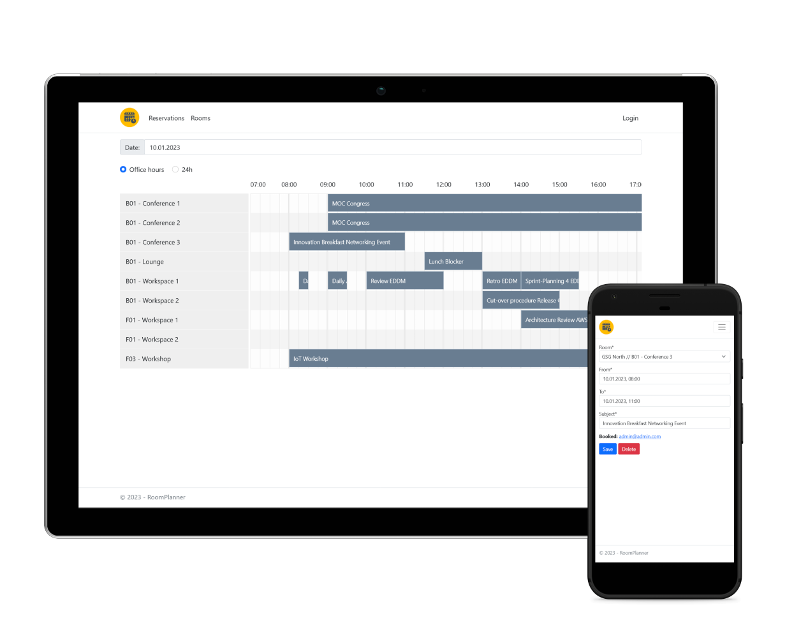

# MVP RoomPlanner
The `RoomPlanner` was part of a project in the **CAS Agile Software Engineering** at BFH (Berner Fachhochschule).  

## Prerequisite for development
- Visual Studio 2022 (recommended) or Rider
- .NET 6 SDK
- Docker in WSL2
- docker-compose

## Create database for development
1. Navigate into docker-compose directory for local-dev  
> cd compose\Development

2. Start docker-services
> docker-compose up -d

## Database-management
### Add database-migration
1. `cd src`
2. `dotnet ef --startup-project .\RoomPlanner.App\ --project .\RoomPlanner.Infrastructure\ migrations add AddInvitationId` (change name of migration)

## Open issues
- messy frontend code (js)
- limited responsiveness for mobile devices
- rooms can only be added directly on the database in this MVP

## State diagram

## Architecture

## Context

